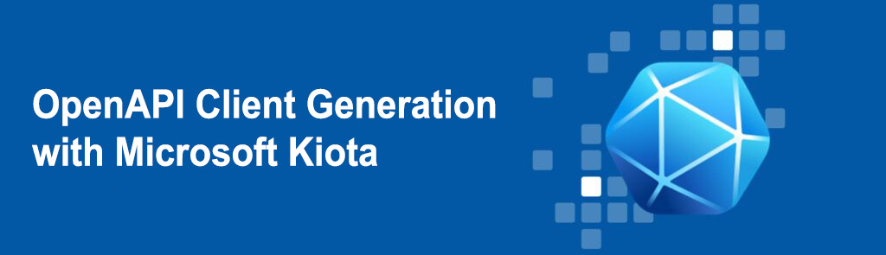
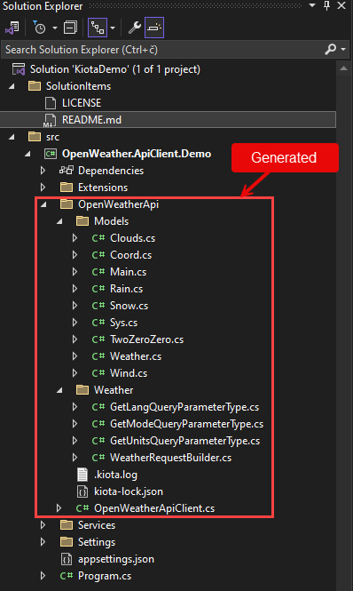

Microsoft **Kiota** is a command line tool released in 2022 for generating an API client to call any OpenAPI-described API you're interested in. The goal is to eliminate the need to take a dependency on a different API client library for every API that you need to call. Kiota API clients provide a strongly typed experience with all the features you expect from a high quality API SDK, but without having to learn a new library for every HTTP API.

## Key Features

-  **Language Agnostic**: **Kiota** provides support for a wide range of languages, including C#, CLI, Go, Java, PHP, Python, Ruby, Swift, and TypeScript.

-  **Full OpenAPI Capabilities**: It leverages the complete capabilities of OpenAPI descriptions.

-  **Full Access to HTTP Capabilities**: Kiota ensures you have full access to HTTP features.

-  **Minimal Code Generation**: It generates only the necessary source code by building on a core library.

-  **Fine-Tuned Generation**: Need only a specific part of the API? No problem.  **Kiota**  lets you filter the generation to the exact surface area you’re interested in.    

-  **Reduced External Dependencies**: **Kiota** minimizes external dependencies.

-  **JSON Schema Integration**: It uses JSON Schema descriptions to generate primitive-based model serialization and deserialization code.

-  **IDE Autocomplete**: The generated code supports IDE autocomplete, aiding in API resource discovery.

-  **Open Source**: **Kiota** is an open-source project, with the code available on GitHub.

## Some key advantages over the NSwag tool
-  **Microsoft Graph Integration**: Kiota is specifically designed to work with the Microsoft Graph API, providing deep integration and support. This makes it a better choice for developers working extensively with Microsoft Graph.
   
-  **Typed Clients**: Kiota generates strongly-typed client libraries, which can improve code quality, maintainability, and developer productivity compared to the more generic, untyped clients generated by NSwag.
    
-  **Extensibility and Customization**: Kiota is designed to be more extensible than NSwag, allowing developers to customize the generated code and add support for new Microsoft services. This makes Kiota a better choice for complex, long-term projects.
    
-  **Open Source**: Kiota is an open-source project, while NSwag has both open-source and commercial versions. The open-source nature of Kiota may be preferred by some developers and organizations.
    
-  **Microsoft Ecosystem Integration**: As a Microsoft-developed tool, Kiota is likely to have tighter integration with other Microsoft tools and services, such as Visual Studio, Azure, and the overall Microsoft development ecosystem.
    
-  **Potential for Improved Performance**: The Kiota-generated client libraries may potentially offer better performance compared to the NSwag-generated clients, as Kiota is designed specifically for working with Microsoft Graph and other Microsoft APIs.
    
However, it's worth noting that NSwag is a more mature and feature-rich tool that supports a wider range of APIs and programming languages. For developers working with a diverse set of APIs, NSwag may still be a viable option. The choice between Kiota and NSwag will depend on the specific needs and requirements of the project, as well as the developer's familiarity and preferences.

## Install Kiota

Visit [https://learn.microsoft.com/en-us/openapi/kiota/install](https://learn.microsoft.com/en-us/openapi/kiota/install)  to see various installation options, in our case, we will use  `dotnet global-tool`

```
dotnet tool install --global Microsoft.OpenApi.Kiota
```


## Demo

This simple console application integrates with [OpenWeather API](https://openweathermap.org/api) which allows 1000 API calls per day for free. This is more than enough for testing purposes.

Now, we are ready to see how it works, but before we start we have to obtain API key.
The API key can be acquired here: [OpenWeather API keys](https://home.openweathermap.org/api_keys).
After that you should fill it in the `appsettings.json` file.

The unique aspect of this demo is that  **HTTP client is automatically generated**  based on OpenAPI and  **Kiota**  each time we build the project.

P.S.
You cant test OpenWeather API also with [OpenWeather Swagger UI](https://idratherbewriting.com/assets/files/swagger/#/).
**Note:**  This sample Swagger file covers the current Weather endpoint only.

## Automatic Client Generation

Since  **Kiota**  ships as `dotnet global-tool` we can easily rely on it as dependency and therefore make it as part of build process. Here is how to build API client every time we build the project. This way we don't need to use **Kiota** CLI everytime.

Add this to `OpenWeather.ApiClient.Demo.csproj`:

```
<Target Name="GenerateClient" AfterTargets="Build" Condition="$(Configuration)=='Debug'">
  <Exec Command="kiota generate -l CSharp --openapi https://idratherbewriting.com/docs/openapi_spec_and_generated_ref_docs/openapi_openweathermap.yml --output OpenWeatherApi --namespace-name $(ProjectName) --class-name OpenWeatherApiClient --exclude-backward-compatible" WorkingDirectory="$(ProjectDir)" />
</Target>
```
Generated code is located under OpenWeatherApi folder:



## Conclusion

Overall, **Kiota** is a promising tool that can significantly streamline the process of working with APIs, making it a valuable addition to any developer’s toolkit.

I hope this demo will be a good start for your next OpenAPI project, enjoy!

## Prerequisites
- [Visual Studio](https://www.visualstudio.com/vs/community) 2022 17.2.6 or greater
- [.NET SDK 8.0](https://dotnet.microsoft.com/download/dotnet/8.0)
- [OpenWeather API](https://openweathermap.org/api)

## Tags & Technologies
- [.NET 8](https://github.com/dotnet/core/blob/main/release-notes/8.0)

## Tools
[Microsoft Kiota](https://learn.microsoft.com/en-us/openapi/kiota/install?tabs=bash#install-as-net-tool)

## Licence
Licenced under [MIT](http://opensource.org/licenses/mit-license.php).
Contact me on [LinkedIn](https://si.linkedin.com/in/matjazbravc).
